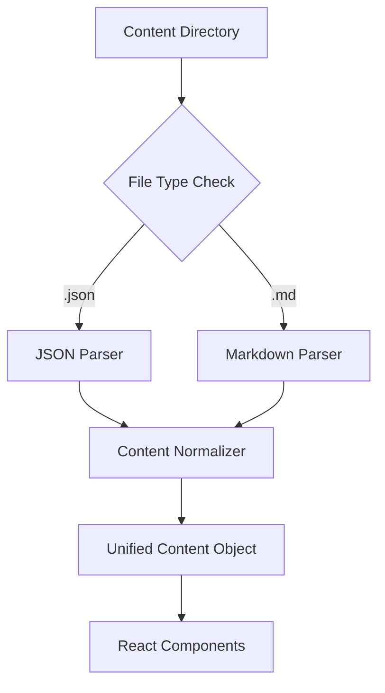

# Design Document

## Overview

This design outlines the migration from JSON-based blog posts to a markdown-based content management system while maintaining backward compatibility. The system will support both formats during the transition period and provide tools for content migration.

The current system uses structured JSON files with a `content` array containing typed blocks (paragraphs, headers, images, code blocks, etc.). The new system will use markdown files with YAML frontmatter for metadata, leveraging standard markdown syntax while preserving the rich content capabilities.

## Architecture

### Content Processing Pipeline



### File Structure

```
app/journal/content/
├── birds-2024.json          # Legacy JSON format
├── miuju-2024.json          # Legacy JSON format
├── new-post.md              # New markdown format
└── another-post.md          # New markdown format
```

### Markdown Format Specification

Markdown files will use YAML frontmatter for metadata:

```yaml
---
title: "Post Title"
slug: "post-slug"
description: "Post description"
keywords: ["tag1", "tag2", "tag3"]
datetime: "2025-02-05T12:02:05Z"
thumbnails:
  - src: "/thumbs/image.jpg"
    alt: "Image description"
technologies:
  - name: "JavaScript"
    icon: "js"
---

# Post Content

Regular markdown content with support for:
- Headers (# ## ###)
- Paragraphs
- **Bold** and *italic* text
- [Links](https://example.com)
- Images: 
- Code blocks with syntax highlighting
- Blockquotes
- Lists
```

## Components and Interfaces

### Content Parser Interface

```typescript
interface ContentItem {
  title: string;
  slug: string;
  description: string;
  keywords: string[];
  datetime: string;
  thumbnails?: Thumbnail[];
  technologies?: Technology[];
  content: ContentBlock[] | string; // JSON array or markdown string
  format: 'json' | 'markdown';
}

interface ContentBlock {
  type: 'h1' | 'h2' | 'h3' | 'h4' | 'h5' | 'h6' | 'p' | 'image' | 'code' | 'blockquote' | 'info' | 'clear';
  content: string;
  language?: string; // for code blocks
  src?: string; // for images
  alt?: string; // for images
  position?: 'left' | 'right' | 'full'; // for images
  location?: string; // for images
  copyright?: string; // for images
  gear?: string; // for images
  caption?: string; // for images
}
```

### Parser Factory

```typescript
class ContentParserFactory {
  static createParser(filePath: string): ContentParser {
    if (filePath.endsWith('.json')) {
      return new JSONContentParser();
    } else if (filePath.endsWith('.md')) {
      return new MarkdownContentParser();
    }
    throw new Error('Unsupported file format');
  }
}
```

### Markdown Parser Implementation

The markdown parser will:
1. Extract YAML frontmatter using `gray-matter`
2. Parse markdown content using `remark` and `remark-html`
3. Convert markdown to the existing ContentBlock structure for compatibility
4. Handle custom image syntax for advanced image positioning

### Enhanced Image Syntax

To support the rich image features from JSON format, we'll use extended markdown syntax:

```markdown

```

This will be parsed into the existing image block structure.

## Data Models

### Unified Content Model

The system will normalize both JSON and markdown content into a unified structure:

```typescript
interface UnifiedContent {
  metadata: {
    title: string;
    slug: string;
    description: string;
    keywords: string[];
    datetime: string;
    thumbnails?: Thumbnail[];
    technologies?: Technology[];
    format: 'json' | 'markdown';
  };
  blocks: ContentBlock[];
}
```

### Migration Mapping

JSON to Markdown conversion rules:
- `title`, `slug`, `description` → YAML frontmatter
- `keywords` array → YAML frontmatter array
- `datetime` → YAML frontmatter
- `thumbnails`, `technologies` → YAML frontmatter
- Content blocks:
  - `h1-h6` → `# ## ### #### ##### ######`
  - `p` → Regular paragraphs
  - `blockquote` → `> quoted text`
  - `code` → Fenced code blocks with language
  - `image` → Extended markdown image syntax
  - `info` → Custom callout syntax `:::info`
  - `clear` → HTML `<div class="clear-both"></div>`

## Error Handling

### File Processing Errors
- Invalid JSON: Log error, skip file, continue processing
- Invalid YAML frontmatter: Log error, treat as plain markdown
- Missing required metadata: Use defaults, log warning
- Duplicate slugs: Prioritize markdown over JSON, log warning

### Content Parsing Errors
- Invalid markdown syntax: Render as-is, log warning
- Missing images: Show placeholder, log error
- Invalid image metadata: Use defaults, continue processing

### Migration Errors
- File write permissions: Log error, continue with other files
- Invalid content structure: Log detailed error, skip problematic blocks
- Encoding issues: Attempt UTF-8 conversion, log if failed

## Testing Strategy

### Unit Tests
- JSON parser functionality
- Markdown parser functionality
- Content normalization
- Migration utility functions
- Error handling scenarios

### Integration Tests
- End-to-end content processing
- Mixed format directory handling
- Route generation with both formats
- Metadata extraction accuracy

### Migration Tests
- JSON to markdown conversion accuracy
- Content preservation validation
- Image metadata preservation
- Special character handling

### Performance Tests
- Large content directory processing
- Memory usage with mixed formats
- Build time impact assessment

## Implementation Phases

### Phase 1: Dual Format Support
- Implement markdown parser
- Update getHeaders.js to handle both formats
- Modify [slug]/page.jsx to process both formats
- Add content normalization layer

### Phase 2: Migration Tools
- Create migration utility script
- Implement JSON to markdown converter
- Add validation tools for converted content
- Create backup and rollback mechanisms

### Phase 3: Enhanced Features
- Implement extended image syntax
- Add custom callout support
- Optimize performance for mixed formats
- Add developer tools for content management

### Phase 4: Cleanup and Optimization
- Remove JSON format support (optional)
- Optimize for markdown-only workflow
- Update documentation
- Performance optimizations